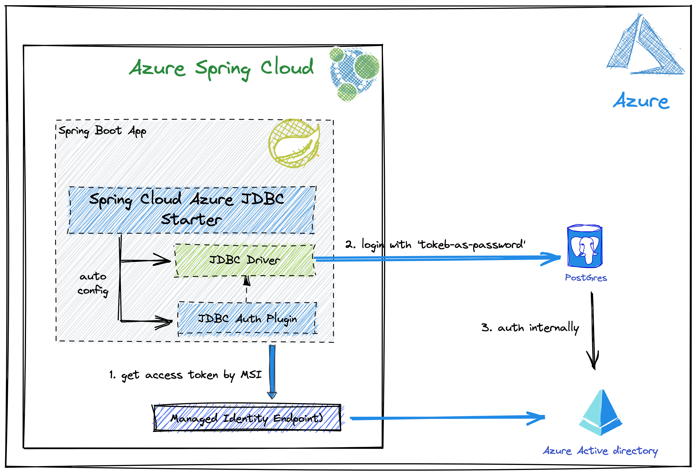

# Azure Credential Free JDBC

This project provides jdbc extension for databases to authentication with MSI.

## How this work



## Connect with Managed Identity to Azure Database for MySQL

To connect to Azure Database for MySQL with Managed Identity using `azure_mysql_msi` extension, please follow below steps:

### Creating a user-assigned Managed Identity for your VM
Please refer to [this doc](https://docs.microsoft.com/azure/mysql/howto-connect-with-managed-identity#creating-a-user-assigned-managed-identity-for-your-vm) to create the Managed Identity.
To do the required resource creation and role management, your account needs `Owner` permissions at the appropriate scope (your subscription or resource group). If you need assistance with role assignment, see [Assign Azure roles to manage access to your Azure subscription resources](https://docs.microsoft.com/azure/role-based-access-control/role-assignments-portal).

### Configuring the Azure Database for MySQL with Azure AD authentication
Please refer to the following links to:
- [Set an Azure AD Admin user for your Azure Database for MySQL](https://docs.microsoft.com/azure/mysql/howto-configure-sign-in-azure-ad-authentication#setting-the-azure-ad-admin-user)
- [Connecting to Azure Database for MySQL using Azure AD Admin user](https://docs.microsoft.com/azure/mysql/howto-configure-sign-in-azure-ad-authentication#connecting-to-azure-database-for-mysql-using-azure-ad)

### Creating a database for your Managed Identity to connect to
After connecting to your MySQL server with Azure AD Admin user, edit and run the following SQL code to create a database. Replace the value `testdb` with your database name.

```sql
CREATE DATABASE testdb;
```

### Creating a MySQL user for your Managed Identity
Please refer to [this doc](https://docs.microsoft.com/azure/mysql/howto-connect-with-managed-identity#creating-a-mysql-user-for-your-managed-identity) to create a MySQL user for your Managed Identity.

Then edit and run the following SQL code to [assign the necessary privileges](https://dev.mysql.com/doc/refman/8.0/en/grant.html#grant-database-privileges) to allow your Managed Identity to access the database.
- Replace the value `ALL` with your needed privileges. 
- Replace the value `testdb` with your database name. 
- Replace the value `myuser` with your MySQL user name for your Managed Identity. 
- Replace the value `somehost` with the public ip address of your vm.

```sql
GRANT ALL ON testdb.* TO 'myuser'@'somehost';
```

### Run the test to connect to Azure Database for MySQL with Managed Identity

You can either run the test using its main method and then you pass in the JDBC URL directly, or if you are running the test using JUnit integration you will have to pass the JDBC URL using the -Durl=xxx syntax.

### What does the JDBC URL look like?

```
jdbc:mysql://hostname:portNumber/databaseName?sslMode=REQUIRED&defaultAuthenticationPlugin=com.azure.jdbc.msi.extension.mysql.AzureMySqlMSIAuthenticationPlugin&authenticationPlugins=com.azure.jdbc.msi.extension.mysql.AzureMySqlMSIAuthenticationPlugin&user=username
```

#### Required modifiable properties

1. `hostname` is the hostname of the MySQL instance
2. `portNumber` is the port number of the MySQL instance
3. `databaseName` is the name of the MySQL database to connect to
4. `username` is the username to connect with (format should be `mysql-username@hostname-only`)

Note `mysql-username` is the name of the MySQL user you created for your Managed Identity, and `hostname-only` is the first part of the FQDN hostname.

#### Required fixed properties

* `sslMode` needs to be set to REQUIRED.
* `defaultAuthenticationPlugin` needs to be set to the implementing class name in this case `com.azure.jdbc.msi.extension.mysql.AzureMySqlMSIAuthenticationPlugin`
* `authenticationPlugins` needs to be set to `com.azure.jdbc.msi.extension.mysql.AzureMySqlMSIAuthenticationPlugin`

### Background information

* https://docs.microsoft.com/azure/mysql/howto-connect-with-managed-identity 
* https://dev.mysql.com/doc/connector-j/8.0/en/connector-j-connp-props-authentication.html
* https://techcommunity.microsoft.com/t5/azure-database-for-mysql-blog/how-to-connect-to-azure-database-for-mysql-using-managed/ba-p/1518196#:~:text=%20How%20to%20connect%20to%20Azure%20Database%20for,the%20Managed%20Identity%20GUID%20and%20then...%20More%20


## PostgreSQL

### How to run the test?

You can either run the test using its main method and then you pass in the JDBC
URL directly, or if you are running the test using JUnit integration you will
have to pass the JDBC URL using the -Durl=xxx syntax.

Note only user-assigned managed identity can be supported at this time because
the JDBC driver does not have a username callback.

### What does the JDBC URL look like?

```
jdbc:postgresql://hostname:portNumber/databaseName?sslmode=require&authenticationPluginClassName=com.azure.jdbc.msi.extension.postgresql.AzurePostgresMSIAuthenticationPlugin&user=username
```

#### Required modifiable properties

1. `hostname` is the hostname of the PostgreSQL instance
2. `portNumber` is the port number of the PostgreSQL instance
3. `databaseName` is the name of the PostgreSQL database to connect to
4. `username` is the username to connect with (format should be `user@hostname-only`)

Note `hostname-only` is the first part of the FQDN hostname.

#### Required fixed properties

* `sslmode` needs to be set to `require`.
* `authenticationPluginClassName` needs to be set to `com.azure.jdbc.msi.extension.postgresql.AzurePostgresqlMSIAuthenticationPlugin`

### Background information

* https://docs.microsoft.com/azure/postgresql/howto-connect-with-managed-identity
* https://github.com/spaceteams/postgres-rds-authentication-plugin
* https://github.com/pgjdbc/pgjdbc/blob/master/pgjdbc/src/main/java/org/postgresql/plugin/AuthenticationPlugin.java
